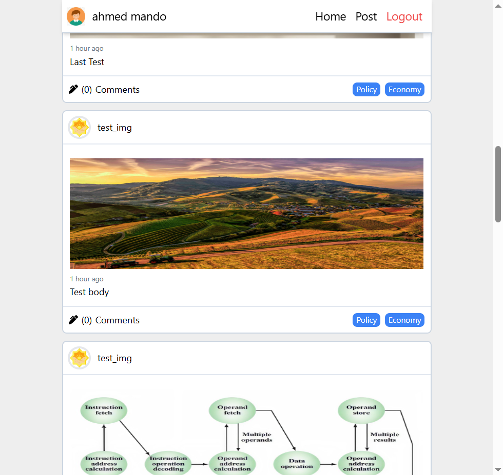
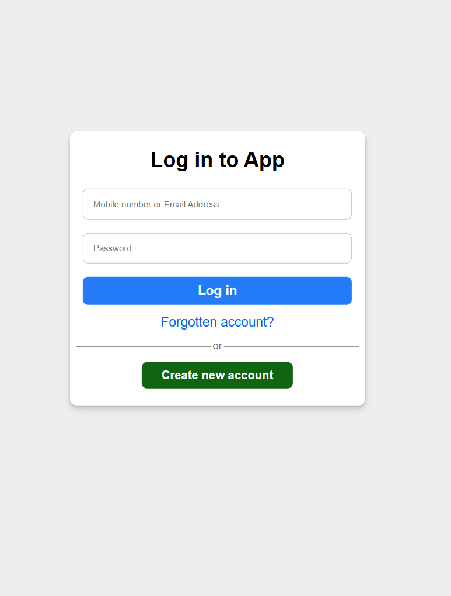
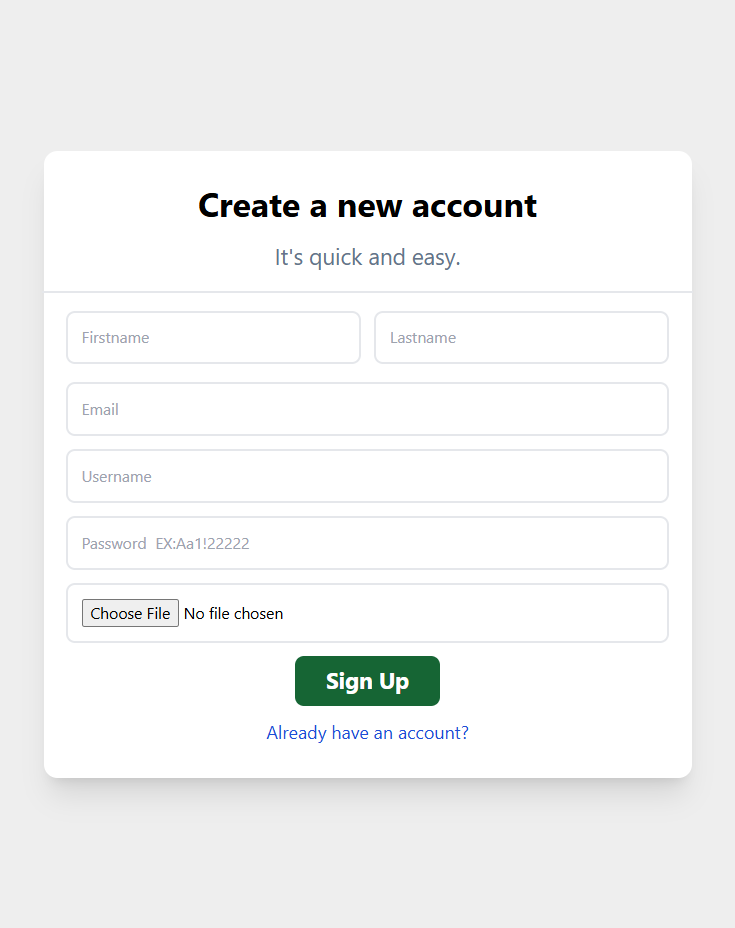
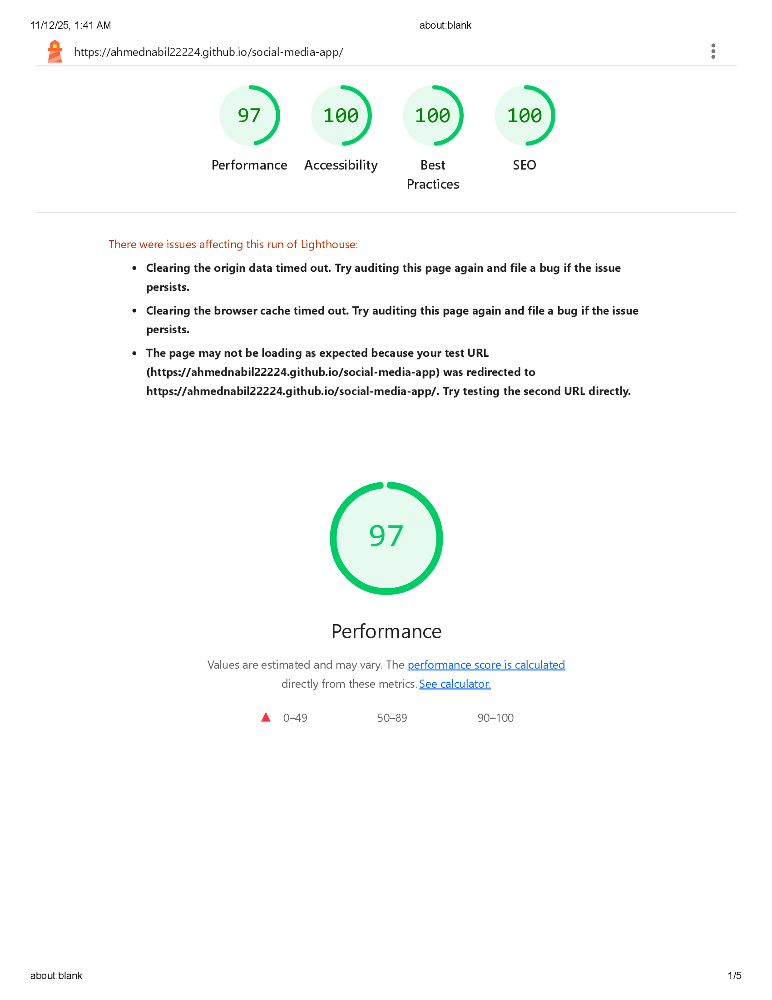

# 🌐 Social Media App

A full-featured social media web application built with React, Redux, and Axios.
Users can register, log in, create posts, upload images, and interact with others in real time.
This project demonstrates my frontend development skills in building scalable and user-friendly applications.

---

🚀 Live Demo

👉 [https://github.com/ahmednabil22224/social-media-app](https://ahmednabil22224.github.io/social-media-app/)

---

# 🚀 Features

User Authentication – Register and log in using JWT tokens

CRUD Posts – Create, read, update, and delete posts

Image Uploads – Upload and display images with posts

Responsive Design – Optimized for mobile and desktop screens

Redux State Management – Centralized store for posts, users, and loading states

Pagination / Infinite Scroll – Efficient post loading with smooth scrolling

Form Validation – Client-side validation for login and registration forms

Error Handling & Loading States – User-friendly error messages and spinners

Protected Routes – Access control for authenticated users only

---

# 🛠️ Tech Stack

Frontend:

React (Hooks, React Router)

Redux / Redux Toolkit

Axios (API communication)

React Virtuoso (infinite scrolling)

Tailwind CSS (styling)

Multer for file uploads

---

# 📦 Installation & Setup

1. **Clone the repository:**

   ```bash
   git clone https://github.com/ahmednabil22224/social-media-app.git

   ```

2. Install dependencies:
   npm install

3. Add environment variables:
   Create a .env file in the root folder and include your API base URL:

4. REACT_APP_API_URL=https://localhost:5000/api/v1

5. Run server:
   node server

6. Run the app:
   npm start

7. Open http://localhost:3000
   in your browser.

---

# 🌍 Deployment

The app is fully deployable on Vercel, Netlify, or any static hosting provider.

Example deployment commands for Vercel:

npm run build
vercel deploy

Make sure your backend API is publicly accessible if hosted separately (e.g., Render, Railway, or Heroku).

---

# 📁 Folder Structure

```
src/
├── api/
│   ├── api.jsx
├── components/
│   ├── Header.jsx
│   ├── AddCommentForm.jsx
│   ├── AddEditForm.jsx
│   ├── AuthModal.jsx
│   ├── LoadSpinner.jsx
│   ├── NotFound.jsx
├── features/
│   └── auth/
│       ├── Login.jsx
│       ├── register.jsx
│       posts/
│       ├── Post.jsx
│       ├── FullPosts.jsx
│       ├── PostDetails.jsx
│       ├── Profile.jsx
│       ├── UserPosts.jsx
├── hooks/
│   ├── useAuth.js
│   ├── useFormValidation.js
├── redux/
│   ├── reducerTypes.js
│   ├── reducerActions.js
│   ├── authReducers.js
│   ├── postsReducer.js
│   ├── rootCombines.js
│   ├── store.js
├── App.jsx
├── index.jsx
└── styles/
    └── tailwind.css
```

---

## 📸 Preview

**Mobile View**
<div align="center">
  
</div>

**Desktop View**


**Login View**


**Register View**


---

## 🌟 Lighthouse Report

| Metric            | Score |
| ----------------- | ----- |
| ⚡ Performance    | 97%   |
| ♿ Accessibility  | 100%  |
| 🛡️ Best Practices | 100%  |
| 🔍 SEO            | 100%  |

images/lighthouse-report.png

## ⚡ Lighthouse Report



---

# 🧠 What I Learned

Building scalable front-end architecture using React and Redux

Implementing reusable hooks for validation, loading, and error handling

Managing async requests with Redux Thunk / Redux Toolkit

Creating responsive and user-friendly layouts

Debugging and optimizing network requests

---

# 🧑‍💻 Author

Ahmed Nabil
Frontend Engineer passionate about building modern, scalable web applications.

💼 LinkedIn

🐙 GitHub

✉️ Email: ahmednabil2222@gmail.com
